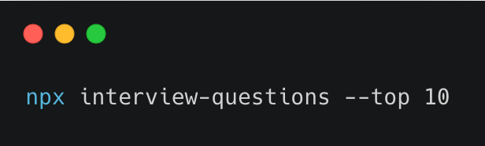
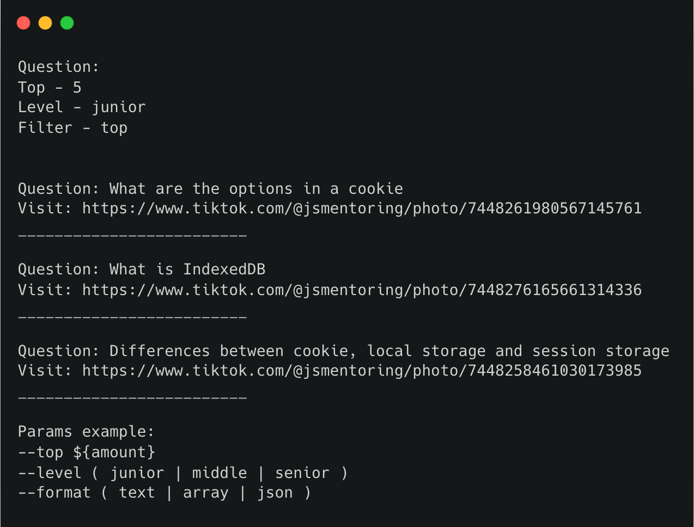

# Interview Questions CLI

Welcome to the **Interview Questions CLI**, a powerful tool designed for users learning JavaScript and practicing coding every day. This repository provides a collection of interview questions categorized by difficulty level, allowing you to learn and improve your skills anytime, directly from your terminal.

## Features

- **Daily Practice**: Access a curated set of JavaScript interview questions to sharpen your coding skills.
- **Difficulty Levels**: Choose questions by difficulty—`junior`, `middle`, or `senior`—to match your skill level.
- **Flexible Output**: Get questions in multiple formats: 
  - `text` for direct display in the terminal.
  - `array` or `json` for use in your projects or further study.
- **Randomized Selection**: Practice with random questions to simulate real-world scenarios.

## Usage

Run the CLI using the following command:

```bash
npx interview-questions [options]
```

### Options

| Option          | Description                                                   | Example                                |
|-----------------|---------------------------------------------------------------|----------------------------------------|
| `--filter`      | Filter questions by type (`all`, `top`). Default is `all`.     | `--filter top`                         |
| `--amount`      | Number of questions to retrieve (for `top` filter).           | `--amount 5`                           |
| `--level`       | Filter by difficulty level (`junior`, `middle`, `senior`).    | `--level junior`                       |
| `--format`      | Output format (`text`, `array`, `json`). Default is `text`.   | `--format json`                        |

### Examples

- Retrieve all questions:
  ```bash
  npx interview-questions --filter all
  ```

- Get the top 5 junior-level questions in JSON format:
  ```bash
  npx interview-questions --filter --top 5 --level junior --format json
  ```

- Get all questions:
  ```bash
  npx interview-questions
  ```


```bash
  npx interview-questions --filter --top 5 --level junior
  ```


## Who is this for?

This repository is perfect for:

- **JavaScript learners**: Enhance your knowledge with targeted practice.
- **Job seekers**: Prepare for interviews by tackling real-world coding problems.
- **Developers**: Quickly access a JSON or array of questions for use in projects or mock tests.

## Connect with Me:
- [LinkedIn - Vitalii Semianchuk](https://www.linkedin.com/in/vitalii-semianchuk-9812a786/)
- [Telegram - @jsmentorfree](https://t.me/jsmentorfree) - We do a lot of free teaching on this channel! Join us to learn and grow in web development.
- [Tiktok - @jsmentoring](https://www.tiktok.com/@jsmentoring) Everyday new videos

## License

MIT License  
Copyright (c) 2024 Vitalii Semianchuk  

## License

This project is licensed under the MIT License. See the `LICENSE` file for details.